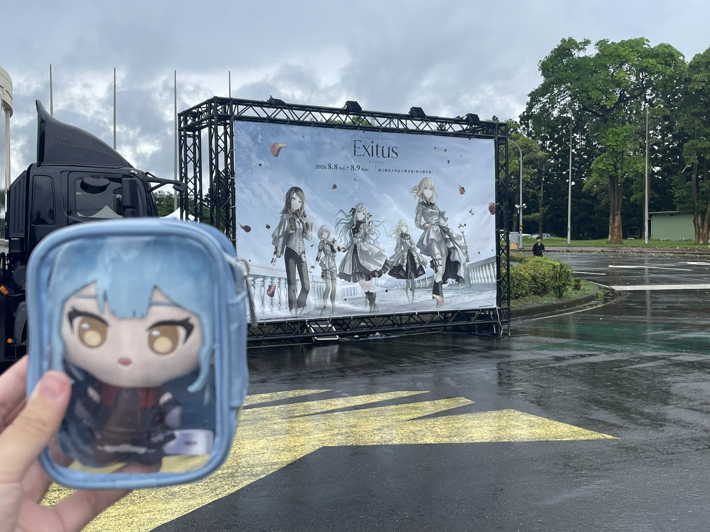
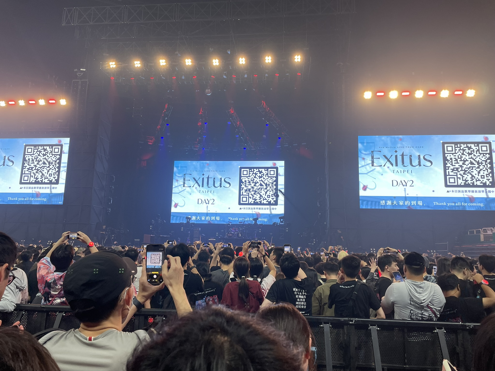

祥子跟看板合照

很慶幸的在4月多釋出消息的時候就第一時間去抽票，首輪就中了。

這次我很幸運(但其實也很不幸運)，的抽到了特D區，拿到了1元加購禮，是一件很好穿的防曬外套。

但為啥我會說很不幸運呢，是因為我只有158左右的身高，我的號碼雖然不算後面，但畢竟特D嘛，前面還是有一區的人遮住，所以就算買了接近10公分的增高鞋，觀賞體驗可能對我來說，還是去上面看台比較好。不過可以在下面站著一起狂歡我很開心，其實還是一個不錯的體驗

附贈視角體驗(有稍微舉手)

## 心得

其實我在[我的threads](https://www.threads.com/share/D11inuTSr/)我就有稍微發過了，這裡應該講的也差不多

第一個就是我茜姐這次造型既然是黑長直，一出場我直接瘋掉，啊啊啊啊黑長直!!!!

接下來就是第二天沒有水元素我其實蠻傷心的，因為我其實非常喜歡水元素，甚至是這首歌將我帶入Ave mujica的世界，想像不到吧嘿嘿，不過有《Georgette Me, Georgette You》也是我的愛歌，但可惜沒新歌

然後D2真的是瘋狂破壞世界觀啊，在唱《顏》的時候，李子甚至一度把GoPro搶走，變成主場攝影，然後還由下往上拍攝夢以的腿，我真的發瘋，然後整首歌一直貼貼，真的是展現了他們五人私下感情很好的一面呢
還有一首歌李子中間似乎是忘詞還是怎麼了，當時我們台下的大家一直在歡呼，結果他唱一唱突然也跟著歡呼，然後弄弄就笑場了，真的很可愛，也好好笑啊

最讓我印象深刻的是最後的謝幕，以往母雞卡為了迎合世界觀，通常不會讓聲優們說太多的話，結果這次台北場，他們謝幕後，還集體跑到台前，站一排偷偷密謀著什麼，結果竟然是五人一起對著大喊的 "ありがとうございまし" 我真的一生難忘，都過了那麼久還是走不出林口體育場。